#    Practica 1 GIT: Inicio 
Para el correcto desarrollo de esta práctica se debe rellenar sobre esta plantilla el desarrollo de cada pregunta con capturas sobre el comando realizado y evidencias.

También se deberá entregar el link al repositorio.
###  Clonar repositorio externo
###  Creación de repositorio local

## 1.-Clonar repositorio externo

1. En un terminal posicionaros donde se creará el directorio del proyecto.
2. Clonad el proyecto de la libreria Jquery que lo mantiene en github.
* https://www.github.com/jquery/jquery.git
```bash
git clone
```
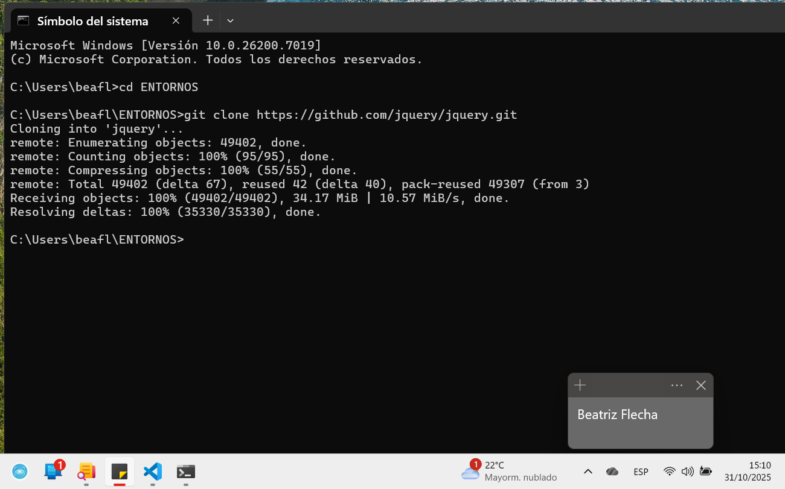

3. Entrad en el directorio creado (jquery) y mostrad un log de los estados por los que ha pasado el proyecto.
```bash
cd jquery
git log
```
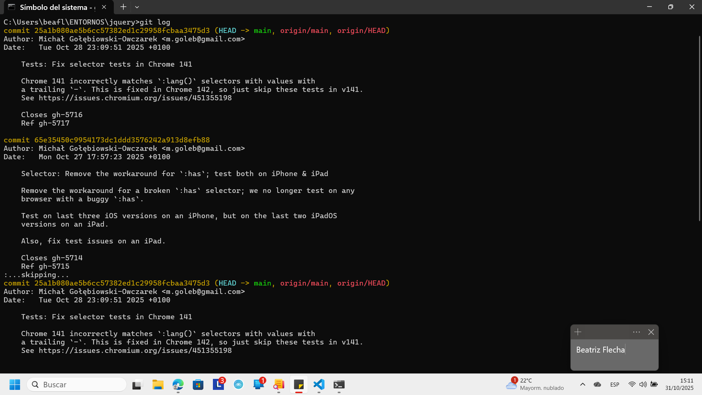
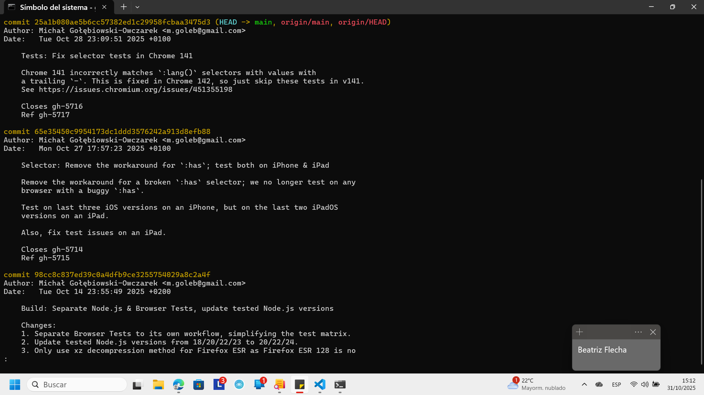
```bash
git log --oneline  //Para verlos en una línea
```
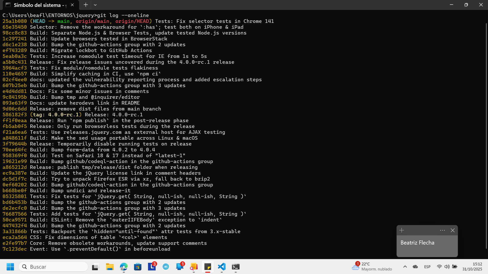

## 2.-Crear un repositorio local

1. Cread un directorio donde vamos a empezar el proyecto y acceder a él.
```bash
mkdir Practica1_GIT
```
2. Inicializad el repositorio 
```bash
git init
```
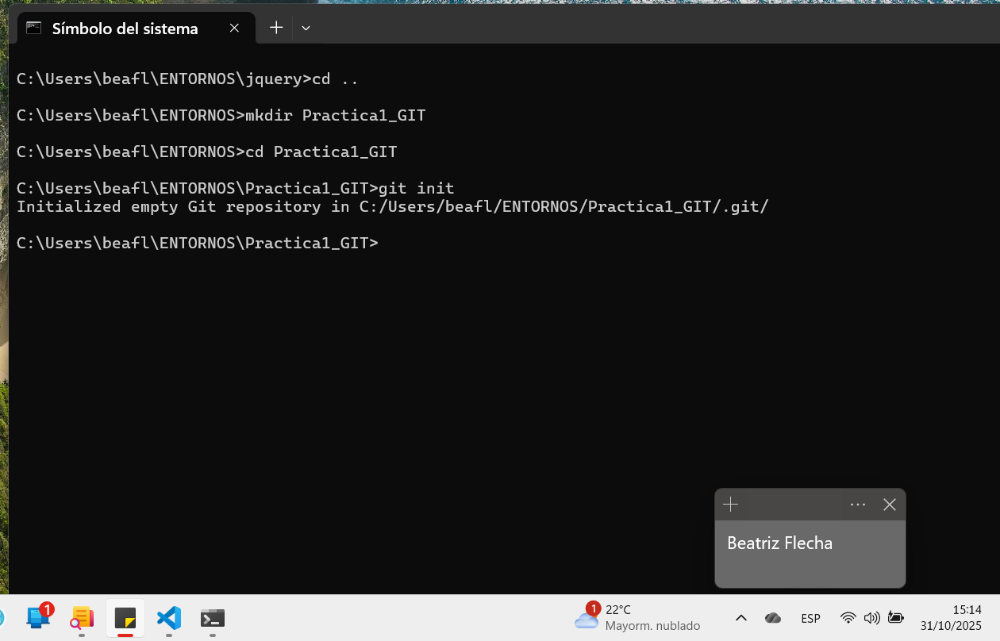

3. Cread un primer archivo "archivo1.txt"
```bash
//En el cmd de Windows
echo El texto que quieres introducir en el archivo > archivo.txt
```
4. Visualizad el estado del proyecto
```bash
git status
```
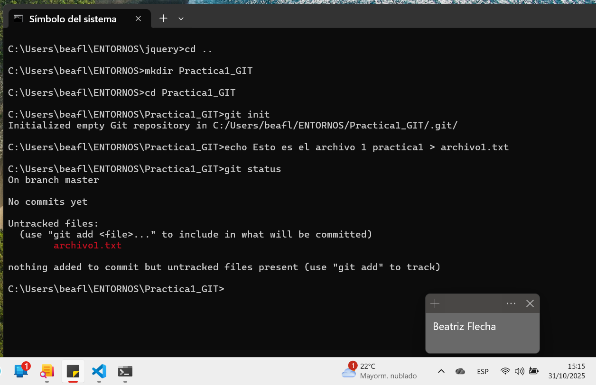

5. Pasad el archivo del espacio de trabajo a la zona de preparación.
```bash
git add archivo.txt
```
6. Visualizad de nuevo el estado del proyecto
```bash
git status
```
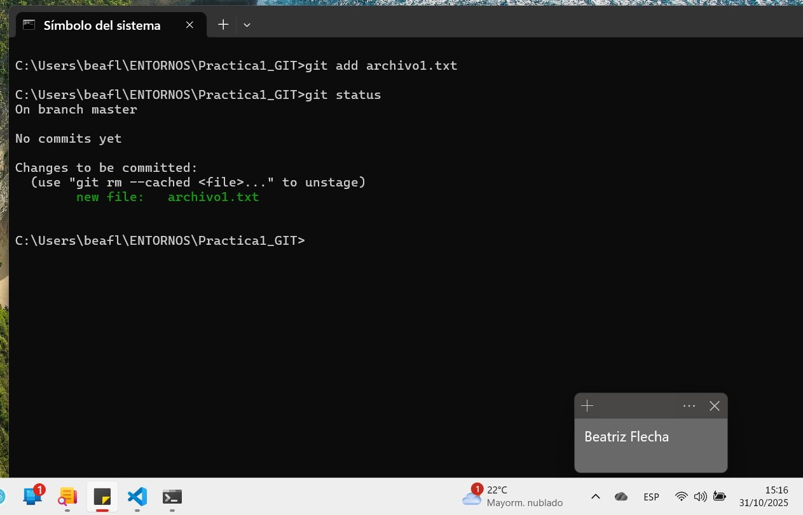

7. Realizad el primer commit y visualizad de nuevo el estado del proyecto.
```bash
git commit -m "Primer commit en archivo1"
git status
```
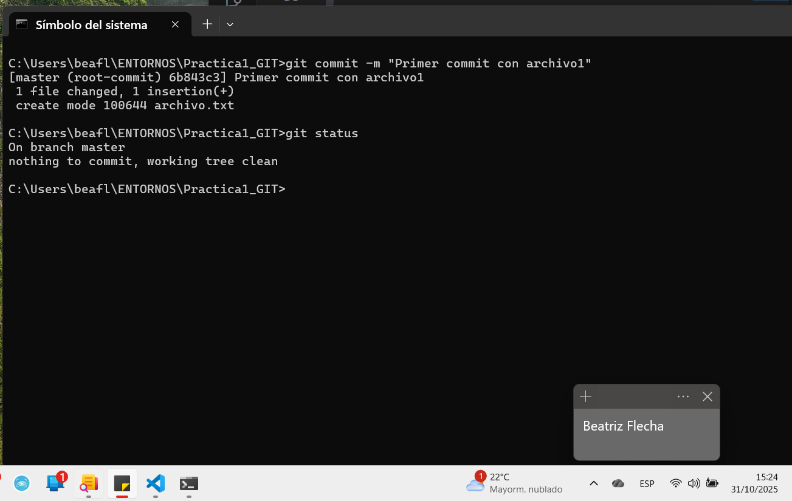

8. Cread dos archivos más al proyecto. "archivo2.txt" y "archivo3.txt"
```bash
echo Segudo archivo2 > archivo2.txt
echo Tercer archivo3 > archivo3.txt
```
9. Pasad el segundo archivo a la zona de preparación.
```bash
git add archivo2.txt
```
10. Haced Segundo commit del proyecto.
```bash
git commit -m "Segundo commit con archivo2"
```
11. Añadid el ultimo archivo a la zona de preparación y realizad el commit.
```bash
git add archivo3.txt
git commit -m "Tercer commit con archivo3"
```
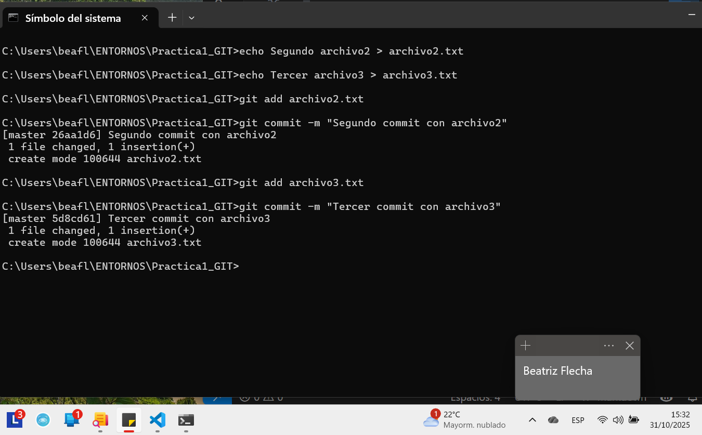

12. Mostrad el log de todos los cambios.
```bash
git log
```
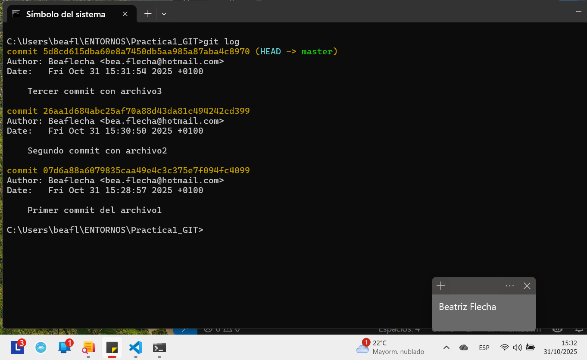

13. Cambiad el archivo "archivo1.txt" y verificad el estado de git.
```bash
echo Modificar archivo1 >> archivo1.txt
git status
```
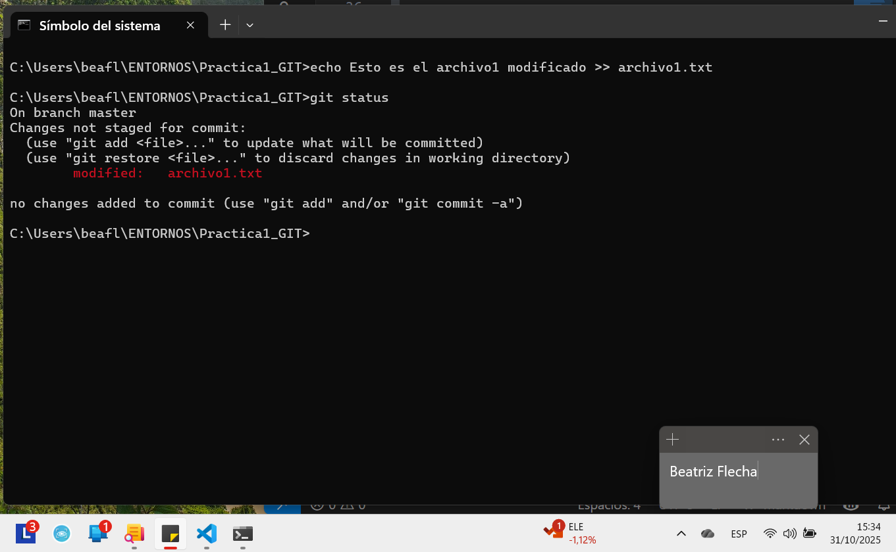

14. Pasad el archivo a la zona de preparación.
```bash
git add archivo1.txt
```
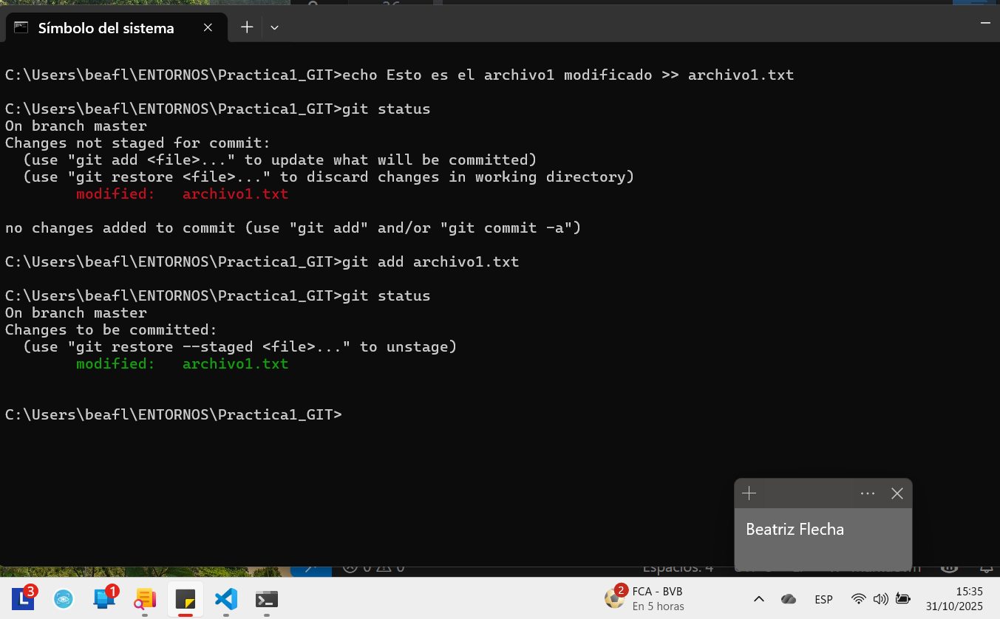

15. Modificad los archivos 2 y 3 del proyecto. Verificad estado del git.
```bash
echo Archivo2 modificado >> archivo2.txt
echo Archivo3 modificado >> archivo3.txt
git status
```
16. Pasad los archivos 2 y 3 a la zona de preparación.
```bash
git add archivo2.txt archivo3.txt
```
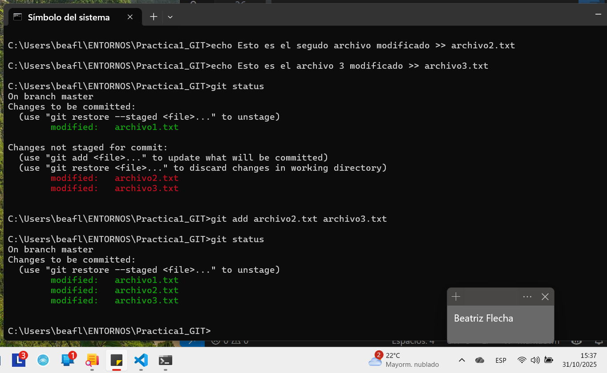

17. Realizar el commit de los cambios realizados.
```bash
git commit -m "Modificados archivos 2 y 3"
//Aquí hay un error en el mensaje
```
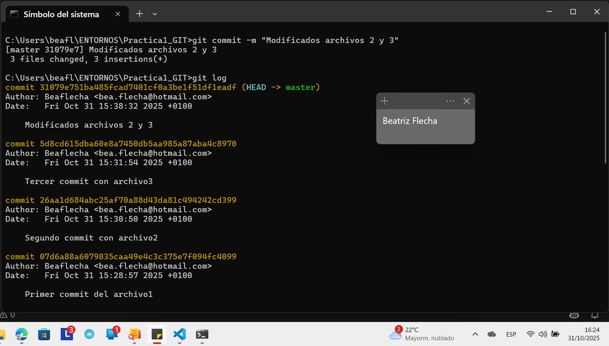
```bash
//Para modificar el comentario del commit
git commit --amend -m "Modificados archivos 1, 2 y 3"
```
.png)

18. Mostrad el log de todos los cambios.
```bash
git log
```
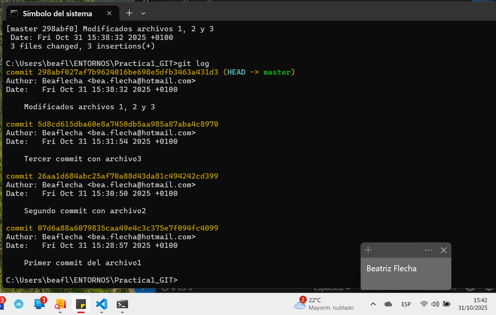


