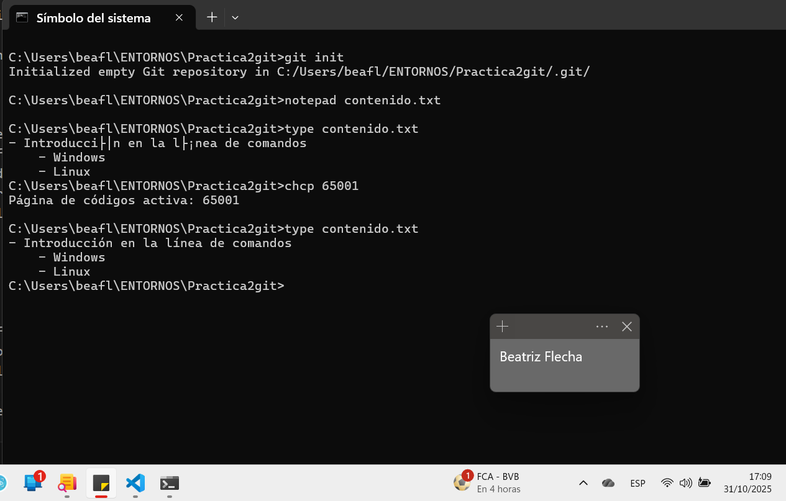
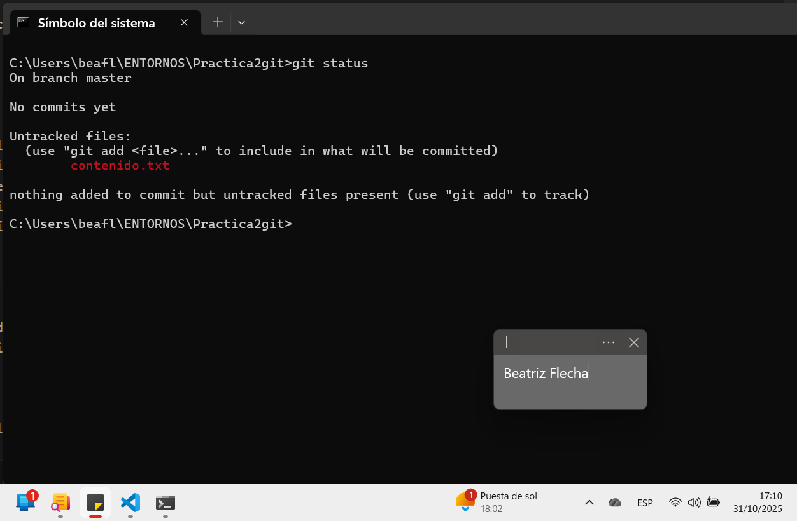
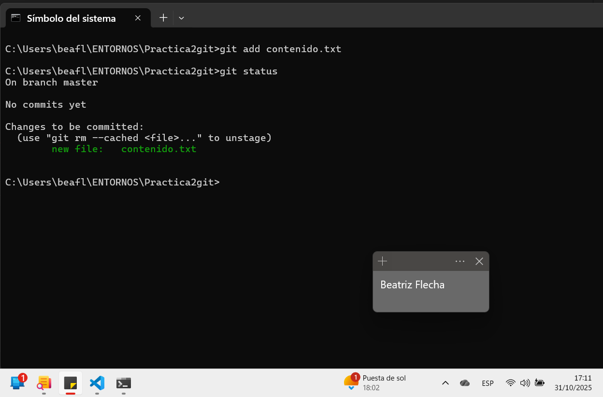
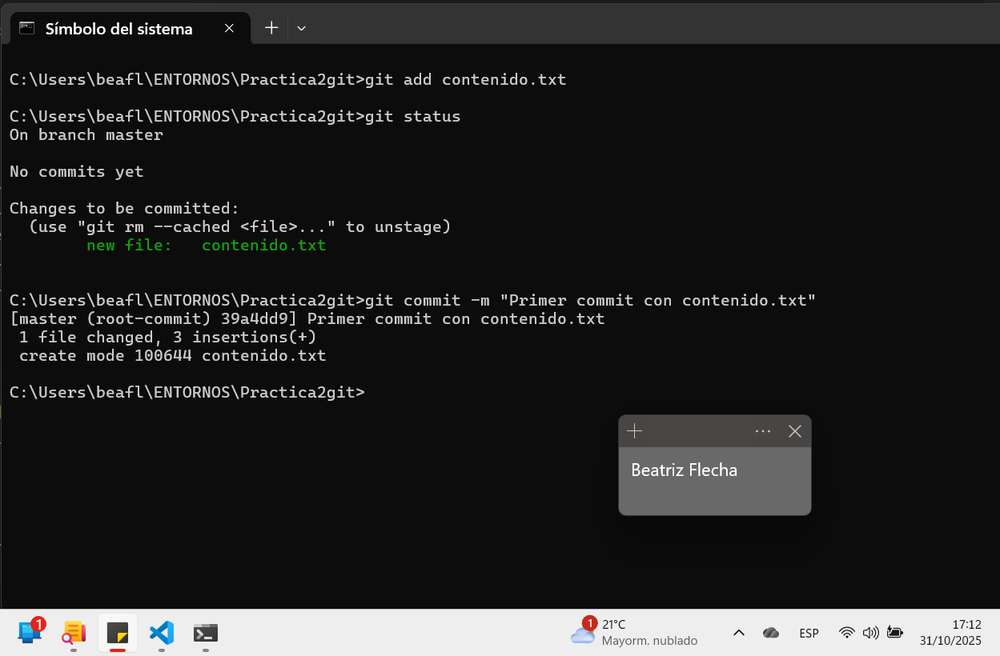
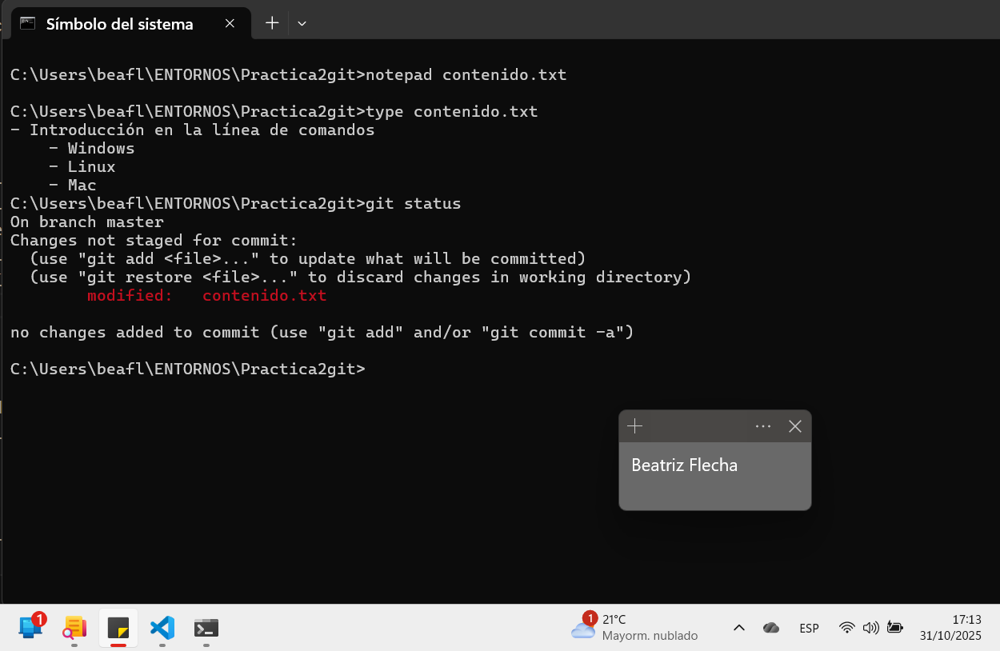
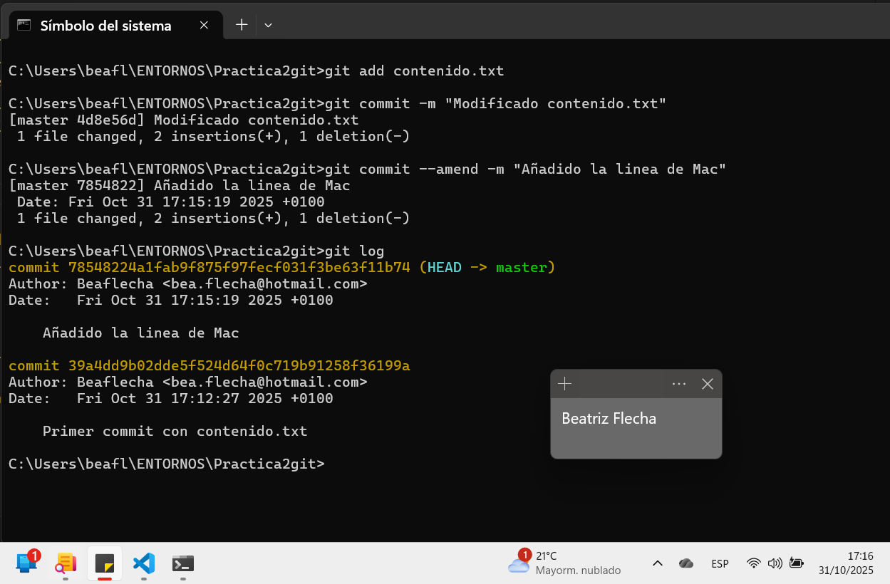

# Practica 2 - GIT

1. Cread un repositorio (directorio) llamado practica2git e inicializa el sistema de control de versiones
```
mkdir Practica2git
git init
```
2. Cread un fichero llamado contenido.txt con el siguiente texto:
```
//Lo creo con notepad
notepad contenido.txt
- Introducción a linea de comandos
    - Windows
    - Linux
```


3. Comprobad el estado del repositorio
```
git status
```


4. Añadid el fichero a la zona de preparado
```
git add contenido.txt
```
5. Comprobad de nuevo el estado del repositorio
```
git status
```


6. Haced el primer commit con su comentario correspondiente
```
git commit -m "Primer commit del fichero contenido.txt"
```


7. Añadid la línea al fichero:
```
notepad contenido.txt
- Mac
``` 
8. Compruebad de nuevo el estado del repositorio
```
git status
```


9. Añadid el fichero a preparado
```
git add contenido.txt
```
10. Haced otro commit del fichero
```
git commit -m "Modificado contenido.txt"
```
11. Cambiad el mensaje del último commit por “Añadido la línea de MAC.”
```
//Para cambiar el mensaje del commit se usa:

$git commit --amend -m "Añadido la linea de Mac"
```
